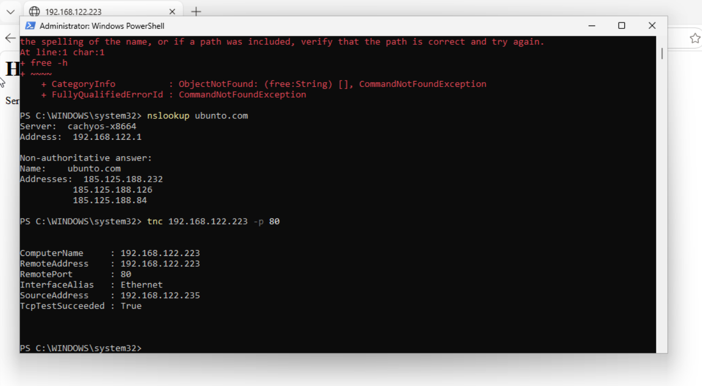
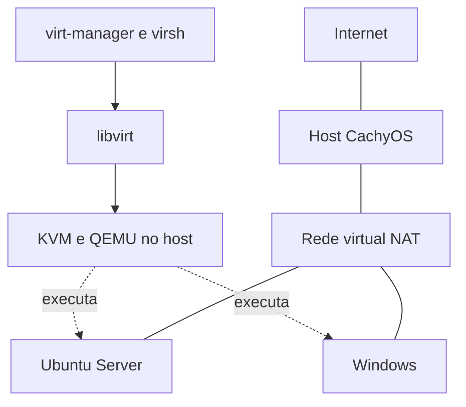

# homelab-infrastructure

Laboratório pessoal de infraestrutura com CachyOS, KVM/QEMU e libvirt, desenvolvido para praticar atividades de Suporte de TI, Infraestrutura e NOC.

**Estado: host, Ubuntu e Windows operacionais; conexão entre VMs e servidor Nginx validados. Página personalizada, logs e recuperação do serviço testados. Backup da página, restauração local e detecção de queda e recuperação por HTTP testados. Primeira versão documentada.**

## Resultados demonstrados

- Duas VMs na rede NAT do libvirt, com SSH e HTTP entre convidados.
- Nginx com página personalizada, logs e recuperação após parada e reinício.
- Backup HTML com SHA-256 e transferência ao host por SCP.
- Monitor HTTP em Bash detectando indisponibilidade e recuperação.

O ambiente é local. Este repositório reúne documentação, script e evidência; não publica a VM nem hospeda seu site na internet.

## Evidências visuais

### Página personalizada no Nginx

*Página HTML personalizada servida pelo Ubuntu e acessada no Windows durante o teste do laboratório. A captura mostra o conteúdo renderizado.*

### DNS e conexão HTTP entre as VMs

*O PowerShell mostra a resolução de ubuntu.com e a conexão do Windows (192.168.122.235) à porta 80 do Ubuntu (192.168.122.223), com TcpTestSucceeded: True. A mensagem vermelha no topo pertence a uma tentativa anterior de executar o comando Linux free no Windows.*

O teste de monitoramento **OK → ALERTA → OK** está registrado em texto na [documentação de backup e monitoramento](docs/05-backup-monitoramento.md).

## Objetivo

Construir, operar e diagnosticar um ambiente Linux/Windows, registrando decisões, comandos, testes e resolução de incidentes. Cada etapa termina com uma evidência verificável e uma explicação do que foi aprendido.

## Ambiente informado

| Item | Situação |
|---|---|
| Host | CachyOS Linux |
| RAM | 15 GiB utilizáveis no host; 2 GiB atribuídos ao Ubuntu |
| CPU | AMD Ryzen 5 5500, 6 núcleos/12 threads, AMD-V |
| Disco disponível | 536 GB livres na partição do host na verificação inicial |
| Pacotes | QEMU/libvirt/virt-manager operacionais; lista exata de pacotes a inventariar |
| KVM funcional | Confirmado com `virt-host-validate qemu` e `hostnamectl` no convidado |

A contagem de flags não comprova 12 núcleos físicos nem garante que a virtualização esteja habilitada no firmware.

## Arquitetura proposta

Ubuntu Server e Windows 11 iniciaram na rede NAT `default`. Endereços observados: Ubuntu `192.168.122.223/24` e Windows `192.168.122.235/24`, ambos sujeitos a mudança por DHCP. Do Windows, o teste TCP à porta 22 do Ubuntu retornou `TcpTestSucceeded : True`, confirmando comunicação entre os convidados nessa porta. NAT permite que as VMs alcancem destinos externos conforme as regras do host; acesso externo não foi testado nesta etapa.

| VM planejada | vCPU inicial | RAM inicial | Disco virtual proposto |
|---|---:|---:|---:|
| Ubuntu Server | 2 | 2 GB | 25 GB |
| Windows | 2 | 4–6 GB | 80 GB |

Windows 11 foi instalado a partir da ISO `Win11_25H2_Portuguese_x64_v2.iso`, com disco virtual SATA de 80 GiB, chipset Q35, UEFI e TPM emulado 2.0 observados na configuração. O Windows iniciou e obteve IP na rede virtual; versão exata dentro do sistema, memória e CPU atribuídas ainda devem ser confirmadas.

Ubuntu instalado: VM com disco VirtIO de 25 GiB e volume raiz LVM de cerca de 12 GiB; o restante do grupo de volumes ficou livre para expansão. O sistema convidado foi instalado a partir de Ubuntu Server 24.04.3 LTS e passou a mostrar 24.04.5 LTS após as atualizações. Hostname `teste`, usuário `gui`. O firmware/boot observado usa GRUB BIOS (`grub-pc`); o uso de UEFI no Ubuntu não foi confirmado.

São valores de planejamento sujeitos à edição do Windows, ao processador e ao armazenamento disponível. Discos dinâmicos crescem com o uso; snapshots também consomem espaço. Evitar outras VMs simultâneas inicialmente.

## Etapas e critérios de conclusão

| Etapa | Prática | Evidência de conclusão |
|---|---|---|
| 1 | Preparar host e validar KVM/libvirt | Validação do host e conexão qemu:///system |
| 2 | Criar Ubuntu Server | Boot, endereço IP e acesso SSH a partir do host |
| 3 | Criar Windows | Boot, drivers e conectividade verificados |
| 4 | Diagnosticar redes | Testes separados de IP, DNS e portas |
| 5 | Administrar serviços | Usuários, permissões e serviço Linux testados |
| 6 | Monitorar o laboratório | Alerta provocado, identificado e resolvido |
| 7 | Backup e recuperação | Restauração testada; snapshot não substitui backup |
| 8 | Simular incidentes | Sintoma, hipótese, causa, correção e reteste documentados |
| 9 | Publicar portfólio | Revisão das evidências e publicação no GitHub |

Windows Server/AD pode ser uma extensão futura; não integra a primeira entrega.

## Documentação

- [Preparação do host](docs/01-host.md)
- [Ubuntu Server e SSH](docs/02-ubuntu-ssh.md)
- [Windows 11 e rede](docs/03-windows-network.md)
- [Servidor web Nginx e captura da página](docs/04-nginx.md)
- [Backup, restauração e monitoramento](docs/05-backup-monitoramento.md)
- [Diário de execução](docs/diario.md)
- [Modelo de incidente](docs/modelo-incidente.md)
- [Política de evidências](evidence/README.md)

## Método

Entender → executar um bloco → observar → explicar → registrar. O autor executou os comandos no CachyOS e compartilhou saídas e capturas; esta documentação foi atualizada com base nessas evidências.

## Referências

Consultadas em 25/09/2026:

- [CachyOS: QEMU e VMM](https://wiki.cachyos.org/virtualization/qemu_and_vmm_setup/)
- [libvirt: daemons e ativação por socket](https://libvirt.org/daemons.html)
- [EDK II: firmware UEFI](https://github.com/tianocore/edk2)
