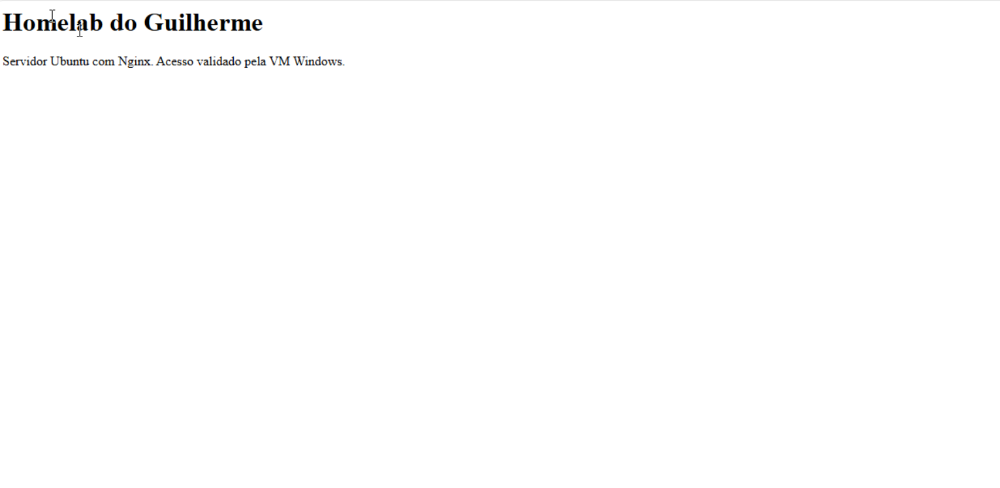

# Servidor web Nginx

## Resultado em 26/09/2026

Nginx instalado no Ubuntu por `sudo apt install nginx`. `systemctl is-active nginx` retornou `active`. A página padrão abriu no navegador da VM Windows em `http://192.168.122.223`.

O primeiro acesso foi feito com HTTPS e recebeu conexão recusada. Ao usar HTTP, conforme a configuração do laboratório, a página abriu. HTTPS ainda não foi configurado.

## Logs e recuperação

O comando `sudo tail -n 10 /var/log/nginx/access.log` mostrou:

```text
192.168.122.235 — GET / HTTP/1.1 — 200
192.168.122.235 — GET /favicon.ico HTTP/1.1 — 404
```

Resumo dos campos observados: o Windows recebeu a página inicial com sucesso; o ícone solicitado pelo navegador não existia.

O autor confirmou que a página deixou de responder após `sudo systemctl stop nginx` e voltou após `sudo systemctl start nginx`. Também confirmou que voltou após reiniciar o Ubuntu, sem iniciar o serviço manualmente.

## Página personalizada

Foi orientada a criação de `/var/www/html/index.html` com o conteúdo abaixo, e o autor enviou a captura do resultado:

```html
<h1>Homelab do Guilherme</h1><p>Servidor Ubuntu com Nginx. Acesso validado pela VM Windows.</p>
```



**Anotação:** a captura mostra o conteúdo personalizado renderizado. O endereço e o sistema cliente não aparecem neste recorte; o contexto do acesso e o IP do cliente foram verificados nos testes anteriores e no log.
